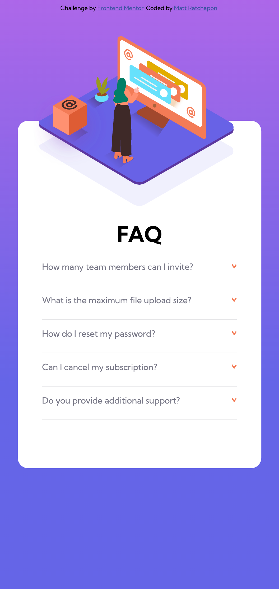
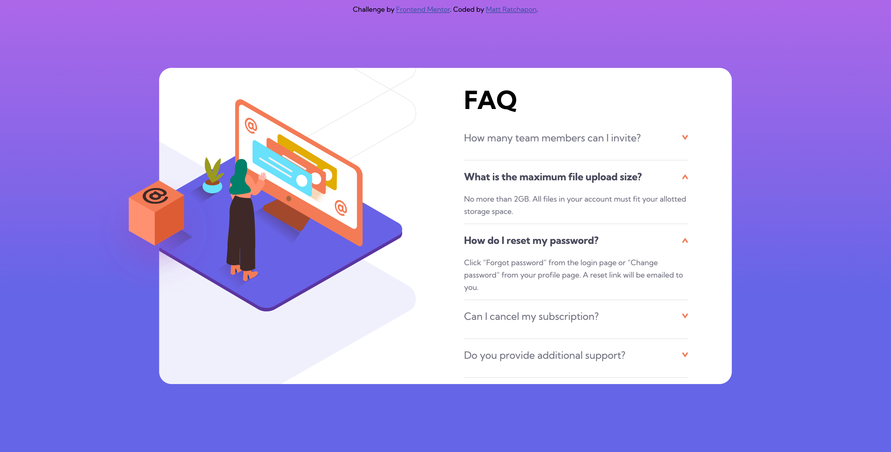

# Frontend Mentor - FAQ accordion card solution

This is a solution to the [FAQ accordion card challenge on Frontend Mentor](https://www.frontendmentor.io/challenges/faq-accordion-card-XlyjD0Oam). Frontend Mentor challenges help you improve your coding skills by building realistic projects.

## Table of contents

- [Overview](#overview)
  - [The challenge](#the-challenge)
  - [Screenshot](#screenshot)
  - [Links](#links)
- [My process](#my-process)
  - [Built with](#built-with)
  - [What I learned](#what-i-learned)
  - [Continued development](#continued-development)
  - [Useful resources](#useful-resources)
- [Author](#author)
- [Acknowledgments](#acknowledgments)

**Note: Delete this note and update the table of contents based on what sections you keep.**

## Overview

### The challenge

Quite simple and easy to make, first I have a problem with javascript but found a solution on youtube.

### Screenshot




### Links

- Solution URL: [Add solution URL here](https://github.com/bbenbboy/5.-faq-accordion-card-main.git)
- Live Site URL: [Add live site URL here](https://5-faq-accordion-card-main-sand.vercel.app/)

## My process

### Built with

- Semantic HTML5 markup
- CSS custom properties
- Flexbox
- CSS Grid
- Mobile-first workflow

### What I learned

Relearned forEach()

```js
faqClick.forEach((faq) => {
  faq.addEventListener("click", function () {
    faq.classList.toggle("active");
  });
});
```

### Continued development

I think too much about forEach() so I made to many classes.

### Useful resources

- [Solution for center the div](https://www.youtube.com/watch?v=PCw06y_v0lM)

- [Solution for dropdown](https://www.youtube.com/watch?v=4qnWreynXLU)

## Author

- Website - [My Resume](https://ratchapon-portfolio.notion.site/Hi-welcome-to-my-portfolio-f45d1ec329d54dac9cd9bf8c217a3f01)
- Frontend Mentor - [@bbenbboy](https://www.frontendmentor.io/profile/bbenbboy)

## Acknowledgments

None
